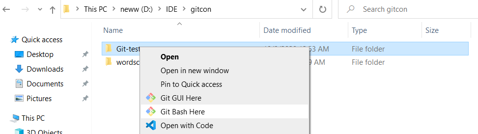

# SemiPJ
kh_semiPJ

처음 git 설정  
git --version 
git init            ---현재 폴더(pwd)에 로컬저장소를 생성. 숨겨진폴더인 .Git를 생성. bash일경우 ls -al 명령어로 확인가능. 
git config --global --list           ---설정정보 
git config --global user.name [id]   ---깃헙 아뒤 쓰면될듯 
git config --global user.email [e-mail]    

git clone https://github.com/New-org-sclass/SemiPJ.git 
clone은 다운로드와 유사. 
 
git remote add [저장소명(임의로작성)] [저장소url]     ---원격저장소 주소 및 정보 추가  
                                                  ---이곳 저장소 url -- https://github.com/New-org-sclass/SemiPJ.git 
git remote rm [저장소명]      ---로컬 저장소url 삭제 
git remote -v              ---추가한 원격 저장소 목록 확인 
git remote show [저장소명] ---지정한 특정 원격저장소의 정보출력. 
 
 
git status        ---현재 로컬저장소에 add한 상황이나 commit된 상황 보여줌. 
git add [file, ...]   ---local git저장소(내컴의 저장소: .Git(숨겨진폴더))에 추가 
git commit -m "메시지들 [실제 commit할 file명(안써도됨)]"  ---변경된 파일 저장완료. 여기까지하면 push할 준비가 된 것. 
 
 
git push 
  로컬 저장소에 commit한 파일들을 원격 저장소에 추가 하는 명령어. 즉, 내가 수정하거나 만든 파일들을 여기 올리는 것 
  git push [저장소명] [브랜치명(master or 각기 생성한 branch명)] 
   ex) git push origin master 
       git push -u origin master == git push --set-upstream origin master 
  파라미터가 없으면 origin 저장소에 push한다. 
 
 

git pull [저장소명] &nbsp;&nbsp;---원격저장소의 최신내용을 로컬저장소로 가져온다.(최신화&동기화)

  추가할 사항 있으면 직접 추가 바랍니다! 
유용한 site : https://backlog.com/git-tutorial/kr/stepup/stepup1_1.html
